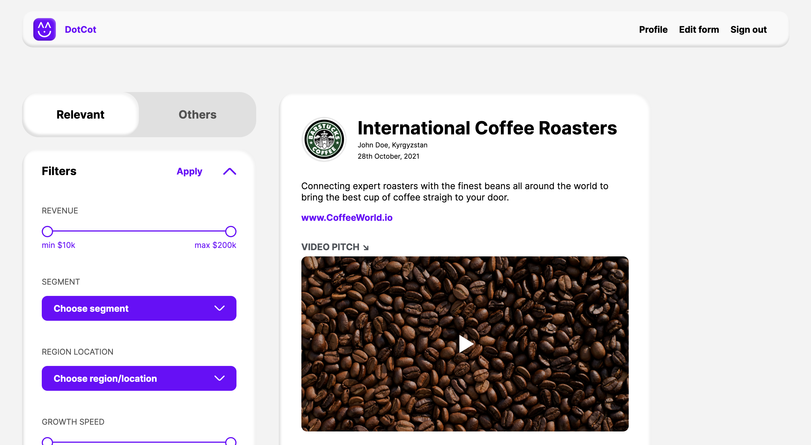

# [View this project live!](https://peaceful-woodland-39661.herokuapp.com/) 🎉

### **DotCot** is an application designed to help investors connect with startups. Gone are the days of irrelevant startups in your inbox. Create a custom form and only get the information you want, nothing else.

## 📣 How does it work?

1. Design a form containing only the fields you specify. Care about revenue? We got you. Don't care so much about location? Leave that field out
2. Create an account to create a custom Url for your form, and share that Url with your network
3. Check back in frequently to see updates to your form submissions on a 

## 🛠 Technologies

- ### **MongoDB | Express.js | React | Node.js**
- **Styled-components**: Makes it all look good
- **Mongoose**: Wraps MongoDB and manages data via a REST Api 
- **Heroku**: Hosts the server in the cloud
- **Passport**: Handles social authentication and user persistance
- **Formik**: Handles form validation on the frontend
- **Mocha**: Allows for the testing our Api utilizing the `supertest` assertion library


## ✨ Demo

---
**Create a form**


---

**Find new startups in your feed**



---

## 🧑‍💻 Get Started
---------------------------------------------------------
**Prerequisites**
- Create project in [Google Developers Console](https://console.developers.google.com/)
- Create project in [Facebook Developers Console](https://developers.facebook.com/)
- Create project in [LinkedIn  Console](https://www.linkedin.com/developers/apps/new)

**Clone**

```
$ git clone https://github.com/vgalilei/venturecat
```
**Install**

```
$ cd venturecat
$ npm install-all
```
**Configure**

`.env.dev` - Needed if starting a `development` environment - _more likely_
```
MONGODB_URI=mongodb://localhost:27017/{{database name}}
FRONTEND_URL=http://localhost:3000
REACT_APP_FRONTEND_URL=http://localhost:3000
REACT_APP_BACKEND_URL=http://localhost:5000/

GOOGLE_CLIENT_ID={{your id}}
GOOGLE_CLIENT_SECRET={{your secret}}

FACEBOOK_APP_ID={{your id}}
FACEBOOK_APP_SECRET={{your secret}}

LINKEDIN_CLIENT_ID={{your id}}
LINKEDIN_CLIENT_SECRET={{your secret}}
```
`.env.prod` - Needed if starting a mock `production` environment - _less likely_
```
MONGODB_URI={{cloud mongo connection uri}}
FRONTEND_URL=''
REACT_APP_FRONTEND_URL=http://localhost:5000
REACT_APP_BACKEND_URL=http://localhost:5000/


GOOGLE_CLIENT_ID={{your id}}
GOOGLE_CLIENT_SECRET={{your secret}}

FACEBOOK_APP_ID={{your id}}
FACEBOOK_APP_SECRET={{your secret}}

LINKEDIN_CLIENT_ID={{your id}}
LINKEDIN_CLIENT_SECRET={{your secret}}
```


**Launch**

```
## Mock development environment
$ npm run dev-start

## Mock production environment
$ npm run static-start
```
**Test**
```
$ npm run dev-test
```
### **Note:** all scripts should be run from the `root` folder

---
**Deployed** - [Using Heroku](https://devcenter.heroku.com/articles/deploying-nodejs#deploy-your-application-to-heroku)


## 🔜 Next Steps

- Display and persist filtered startups on Investor Landing Page
- Handle submission of pdf and images in Startup Form
